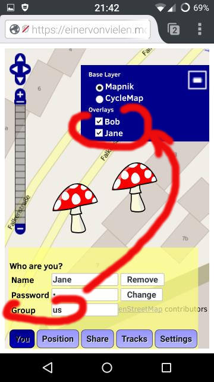

# Find your Friends on a Map

* runs in every modern browser
* very easy to use

It's about privacy. Reclaim the internet from authorities and companies! More on this further down.

It might be that you mobile device will pause the sharing (upload, download) of positions as long as the sceen is switched off.

## Example: Jane and Bob share their Geo-Location.

### All they have to do is...

1. to open a link as on this [demo server](http://jfellow.net/geo5)
2. to enter: User "Jane", Pass "secret", Group "us"

**Important** - they use the **same group** "us" to see each other on the map.

Privacy: ALL your data is deleted from the server if you press "Remove".

### They can fine tune it

# Why to use this software?

It's about privacy. Reclaim the internet from authorities and companies!

Why not using Google+ to share your position?
Because they recorded your data for good in big databases and try to sell your data.

Mushrooms can run on your own server. You are in control of the service and your data.

There are no backdoors. You can check the code.
And its free.

# How...to install?

Make sure you have a php-enabled webserver, let's name it http://example.com/

Use the link "Download ZIP" (see above, on the right hand side) and unzip it on your server to http://example.com/geo5/.

Test it! Open http://example.com/geo5/ in a browser (not IE).

Expected Result: You should see a map with a marker.

# How to use other Senders?

Make sure the server is running somewhere as described above.
Alternatively you can use this demo server: http://jfellow.net/geo5/

## OSMand as Sender

1. Download and install OSMand on your Android device.
2. As online tracking URL use http://jfellow.net/geo5/geo5.php?lat={0}&lon={1}&time={2}&speed={5}&altitude={4}&user=you&pass=secret&group=yourgroup&storeTrack=true
3. Start the tracking.

## Another (second) Browser as Sender

You can even use the address bar of a browser to send your position:

    http://jfellow.net/geo5/geo5.php?user=you&pass=secret&group=yourgroup&lat=48.1375&lon=11.5755&speed=50&altitude=530.75&accuracy=18&time=1378655632757&storeTrack=false

Of course you can draw a track if you use "storeTrack=true".

#  Please help by...

...contributing ideas, bug fixes and modifications. Fun is guaranteed.

    
